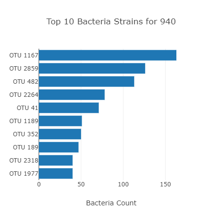
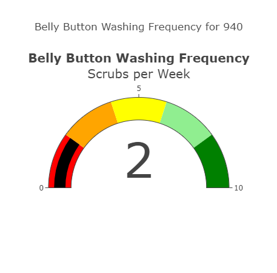
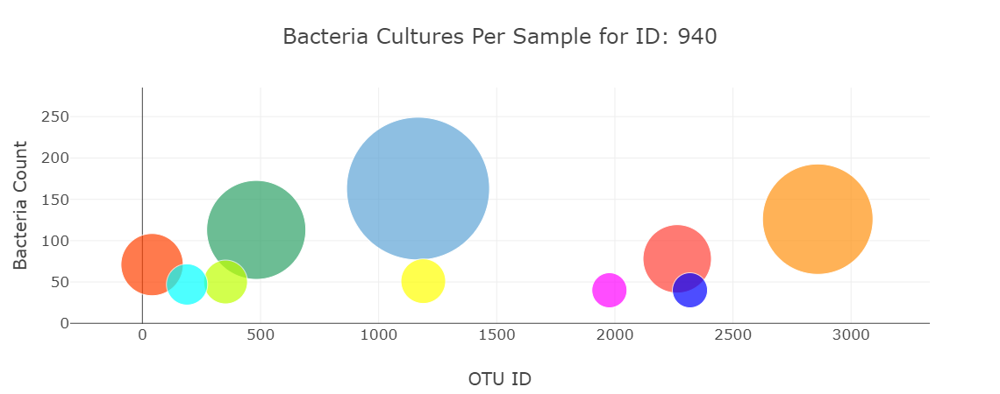

# Belly_Button_Biodiversity 🕺
OSU Challenge #12 - Plotly.js


Using Plotly.js to create bar charts:

```javascript
var trace = {
      x: sample_values,
      y: OTU_name,
      text: otu_labels,
      name: "Bacteria",
      type: "bar",
      orientation: "h"
    };
      console.log(yticks);
    // 8. Create the trace for the bar chart. 
    var barData = [trace];


    // 9. Create the layout for the bar chart. 
    var barLayout = {
      title: `Top 10 Bacteria Strains for ${sample}`,
      yaxis: {autorange : 'reversed'},
      xaxis: {title: 'Bacteria Count'}
    };
    // 10. Use Plotly to plot the data with the layout. 
    Plotly.newPlot("bar", barData, barLayout);
```


Using Plotly.js to create a gauge chart

```javascript
var data_gauge = [
      {
        gauge: {
          bar: { color: "black" },
          axis: { range: [0, 10]},
          steps: [{range: [0, 2], color: 'red'},
                  {range: [2, 4], color: 'orange'},
                  {range: [4, 6], color: 'yellow'},
                  {range: [6, 8], color: 'lightgreen'},
                  {range: [8, 10], color: 'green'}]},
        value: result.wfreq,
        title: { text: "<b>Belly Button Washing Frequency</b><br>Scrubs per Week" },
        type: "indicator",
        mode: "gauge+number"
      }
    ];

    // 5. Create the layout for the gauge chart.
    var gaugeLayout = {
      title: `Belly Button Washing Frequency for ${sample}`
    };
```
    


Using Plotly.js to create a bubble chart.

```javascript
// 1. Create the trace for the bubble chart.
    var trace_bubble = {
      x: yticks,
      y: sample_values,
      text: otu_labels, otu_ids,
      mode: 'markers',
      marker: {
        color: ['rgb(93, 164, 214)', 'rgb(255, 144, 14)', 'rgb(44, 160, 101)', 'rgb(255, 65, 54)', 'rgb(255, 64, 0)',
          'rgb(255, 255, 0)',
          'rgb(191, 255, 0)',
          'rgb(0, 255, 255)',
          'rgb(0, 0, 255)',
          'rgb(255, 0, 255)'],
        size: sample_values
      }
    };

    var bubbleData = [trace_bubble

    ];

    // 2. Create the layout for the bubble chart.
    var bubbleLayout = {
      title: `Bacteria Cultures Per Sample for ID: ${sample}`,
      font: {size: 17},
      xaxis: {title: 'OTU ID'},
      yaxis: { title: 'Bacteria Count' }


    };

    // 3. Use Plotly to plot the data with the layout.
    Plotly.newPlot("bubble", bubbleData, bubbleLayout);

```


